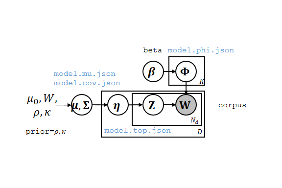

Scalable inference for Correlated Topic Models (ScaCTM)
====

Introduction
----

[Correlated Topic Model](https://www.cs.princeton.edu/~blei/ctm-c) is a topic model for text or other discrete data that models correlation between the occurrence of different topics in a document (Figure 1).

ScaCTM is software that learn Correlated Topic Model of thousands of topics from millions of documents, with tens of machines.

Figure 1. Correlated Topic Model. (Blue monospace: output file names, Black monospace: input parameter names)

The generative model is described as follows.

Below is the speed of ScaCTM on some corpus. For more details, please refer to our [paper](#reference).

<table>
<tbody>
<tr><td> corpus</td><td> number of documents </td><td> number of topics </td><td> time </td></tr>
<tr><td> NIPS </td><td> 1.2K </td><td> 100 </td><td> 8.9 min </td></tr>
<tr><td> 20NG </td><td> 11K </td><td> 200 </td><td> 9 min </td></tr>
<tr><td> NYTimes </td><td> 285K </td><td> 400 </td><td> 0.5 hrs </td></tr>
<tr><td> Wiki </td><td> 6M </td><td> 1000 </td><td> 17 hrs </td></tr>
</tbody>
</table>

Install
----

Assume you already have BLAS and LAPACK installed, to build ScaCTM, simply do

	git clone --recursive http://github.com/cjf00000/ScaCTM.git
        cd third_party
        make                    # Install third-party dependencies, takes 6 minutes on our 12-core server
        cd ..
        cd src
        make -j                 # Build ScaCTM in parallel
        cd ..

See [BLAS](#blas) if you don't have BLAS and LAPACK.

Chinese users: if you have trouble installing, see [this](https://github.com/cjf00000/ScaCTM/issues/1).

For offline installation, download everything in `https://github.com/cjf00000/ScaCTM/releases`, put them in `third_party/third_party/src`, then do the normal installation sequence above.

Usage
----

First you need to set some environment variables

        source scripts/setenv_bash      # for bash
        source scripts/setenv_csh       # for csh

Then, copy ScaCTM to every nodes of cluster. We assume you have two nodes, `juncluster1` and `juncluster2`, and ScaCTM is stored at `juncluster1:ScaCTM`

        scp -r ScaCTM juncluster2:

**Note: you need to execute `source scripts/setenv_<your shell>` in every shell session.**

### Input data
Download the example data, from [Yahoo-LDA](https://github.com/sudar/Yahoo_LDA)

        mkdir work && cd work   # We'll do everything in work/
        wget https://raw.github.com/sudar/Yahoo_LDA/master/test/ydir_1k.txt

Now, take a look at the data. Every document is a single line in the file, every line is 

        docid site word_1 word_2 ...

You need to make sure that `docid` is unique. `site` is not used by ScaCTM currently, just for compatibility with Yahoo-LDA. Followed by these two fields are all the words in the corpus. You may wish to do some pre-processing, e.g. remove stop words.

### Train

First, open a file `machinefile`, put the following lines

        juncluster1
        juncluster2

Which are the hostnames for your cluster.

Look at help of `ctm-train`

        ctm-train --help

Now we want to train a model with default parameters

        ctm-train -f machinefile ydir_1k.txt

If you only have one machine, use

        ctm-train ydir_1k.txt

The training is now started, you will see its progress on your console

        Training on juncluster1, juncluster2 (2 nodes).
        Distributing executables...
        Done (7.418916 seconds).
        Starting server...
        Formatting corpus ydir_1k.txt...
        Done (1.675312 seconds).
        Training
        100.000000%
        Done (68.470395 seconds).
        Gathering results...
        Done (13.113103 seconds). Model stored in /home/jianfei/tmp/ScaCTM/work/ydir_1k.txt.model.

When the training is completed, the result in stored in `ydir_1k.txt.model/info`

* `model.topToWor.txt` is learned topics
* `model.dict.json` is a list of dictionary / vocabulary
* `model.phi.json` is a V * K matrix phi, where V is vocabulary size and K is number of topics. phi[v, k] = p(w=v | z=k, phi) is the probabilty of word v of topic k. Word v is the v-th line in `model.dict.json`.
* `model.mu.json`, `model.cov.json` are prior mean and covariance. `model.corr.json` is the correlation matrix.
* `model.top.json` is the topic distribution `eta` for each document. It uses `docid` provided in data as key and `eta` as value.

### Train and test

We need a training set and testing set

        make_test_data.sh ydir_1k.txt ydir_1k.txt.train ydir_1k.txt.test 0.8

You'll get a training set and a testing set with 8:2 documents.

Train

        ctm-train -f machinefile ydir_1k.txt.train

Test

        ctm-test -m ydir_1k.txt.train.model/ ydir_1k.txt.test 

Test result is stored in `ydir_1k.txt.test.result/info`.

### Perplexity evaluation

Sometimes you want to measure the perplexity on a test set. You need to further divide every document in the test set into an observed part and a heldout part. We'll infer eta on the observed part and measure perplexity on the heldout part. See the [paper](#reference) for detail.

        make_test_data.sh ydir_1k.txt ydir_1k.txt.train ydir_1k.txt.test_observed 0.8 ydir_1k.txt.test_heldout

You'll get a training set and a testing set with 8:2 documents, the test set is further divided into an observed part and a heldout part.

Train

        ctm-train -f machinefile ydir_1k.txt.train

Test

        ctm-test -m ydir_1k.txt.train.model/ --heldout ydir_1k.txt.test_heldout ydir_1k.txt.test_observed

Perplexity is shown at the bottom.

	Testing on juncluster1, juncluster2 (2 nodes).
	Distributing executables...
	Done (3.956380 seconds).
	Broadcasting model...
	Done (2.808829 seconds).
	Starting server...
	Formatting corpus ydir_1k.txt.test_observed...
	Done (0.642709 seconds).
	Testing
	100.000000%
	Done (4.367594 seconds).
	Gathering results...
	Done (4.367329 seconds). Output stored in ydir_1k.txt.test_observed.result.
	Computing held-out perplexity
	Perplexity = 1112.114460

BLAS
----

If you don't have BLAS and LAPACK, you can simply install them by package manager, for example

        sudo apt-get install libblas-dev
        sudo apt-get install liblapack-dev

will install [Netlib reference implementation](http://www.netlib.org/blas/) on Ubuntu systems.

If you are working with a lot of short documents and many topics (>=500), you may wish to use a faster BLAS. There are many possible options, for example, to install [ATLAS](http://math-atlas.sourceforge.net/)

        sudo apt-get install libatlas3-dev

and rebuild the code

        cd src
        make clean && make -j

make sure ATLAS is used by ScaCTM

        # See which BLAS is ScaCTM using
        $ ldd /bin/learntopics
        <skipped>
        libblas.so.3gf => /usr/lib/libblas.so.3gf (0x00007f7c770e0000)
        <skipped>

        # Find the path of /usr/lib/libblas.so.3gf
        $ ls -l /usr/lib/libblas.so.3gf
        /usr/lib/libblas.so.3gf -> /etc/alternatives/libblas.so.3gf 

        $ ls -l /etc/alternatives/libblas.so.3gf
        /etc/alternatives/libblas.so.3gf -> /usr/lib/atlas-base/atlas/libblas.so.3gf

if you are still using the old BLAS, you can manually link with ATLAS by modifing `LDFLAGS` in `src/Makefile`. You can also use other BLAS such as MKL or ACML by modifing `INCFLAGS` and `LDFLAGS` in `src/Makefile`.

### NOTE

Be cautious with OpenBLAS, we find ScaCTM works extremely slow with OpenBLAS.

Bugs / New Features
----

Please [create a issue](https://github.com/cjf00000/ScaCTM/issues/new) for us if you found any bugs or want any new features. We look forward for your suggestions!

Dependencies
----

ScaCTM is built upon the [Yahoo-LDA](https://github.com/sudar/Yahoo_LDA), which is a distributed framework for topic modeling.

License
----

Apache License 2.0

Reference
----

Please cite our paper if you find ScaCTM is useful!

Jianfei Chen, Jun Zhu, Zi Wang, Xun Zheng, and Bo Zhang. Scalable Inference for Logistic-Normal Topic Models, Advances in Neural Information Processing Systems (NIPS), Lake Tahoe, USA, 2013. (NIPS 2013)

Some demonstration can be found at http://ml.cs.tsinghua.edu.cn/~scalable-ctm/.
